# 📊 SEQUENCE DIAGRAMS - Simple Auction Game

**Project:** Simple Auction Game  

---

## 🎯 Cách Xem Sequence Diagrams

Các sequence diagrams trong file này được viết bằng **Mermaid syntax**. Để xem dạng hình vẽ:

### **Cách 1: Xem trên GitHub** (Khuyên dùng - Đơn giản nhất)
1. Mở file này trên GitHub: `docs/SEQUENCE_DIAGRAM.md`
2. GitHub tự động render Mermaid thành hình vẽ
3. ✅ Không cần cài đặt gì!

### **Cách 2: Xem trong VS Code**
1. Cài extension: **"Markdown Preview Mermaid Support"** by Matt Bierner
   - Nhấn `Ctrl + Shift + X` → Tìm "Markdown Preview Mermaid Support" → Install
2. Mở file `SEQUENCE_DIAGRAM.md`
3. Nhấn `Ctrl + K` rồi `V` → Xem preview bên cạnh
4. Hoặc `Ctrl + Shift + V` → Preview toàn màn hình

### **Cách 3: Xem online**
1. Copy code Mermaid (phần trong \`\`\`mermaid ... \`\`\`)
2. Vào https://mermaid.live
3. Paste code vào → Xem kết quả ngay

---

## 📖 Mục Lục

1. [Server Startup Sequence](#1-server-startup-sequence)
2. [Client Connection Sequence](#2-client-connection-sequence)
3. [Bid Placement Sequence (Success)](#3-bid-placement-sequence-success)
4. [Bid Placement Sequence (Failed)](#4-bid-placement-sequence-failed)
5. [Race Condition Handling](#5-race-condition-handling-với-lock)
6. [Timer Update Sequence](#6-timer-update-sequence)
7. [Warning Sequence](#7-warning-sequence-10s--5s)
8. [Auction End - Winner](#8-auction-end---có-winner)
9. [Auction End - No Winner](#9-auction-end---không-có-winner)
10. [Client Disconnect](#10-client-disconnect-sequence)
11. [Server Shutdown](#11-server-shutdown-sequence)

---

## 1. Server Startup Sequence

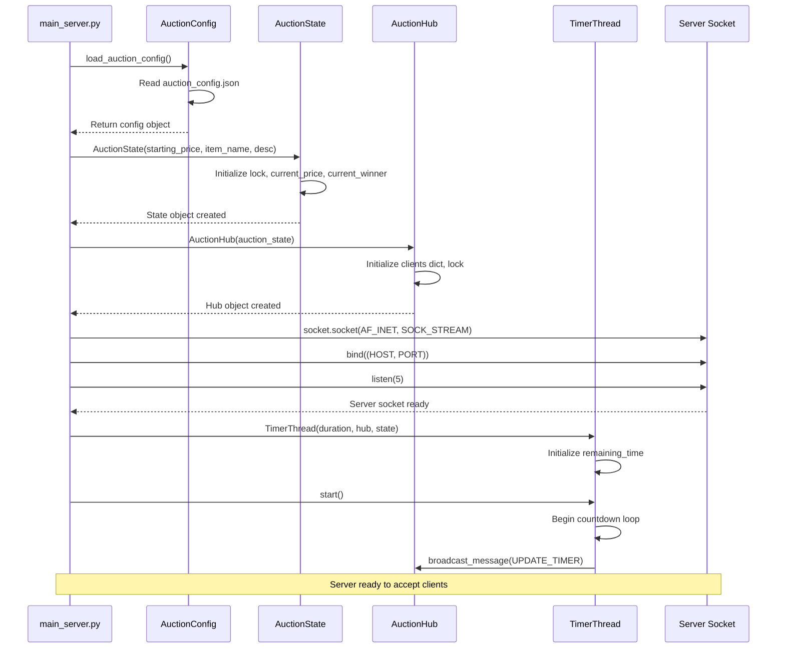

**Mô tả:**
1. Main server load config từ JSON file
2. Khởi tạo AuctionState với lock để bảo vệ giá
3. Khởi tạo AuctionHub để quản lý clients
4. Tạo socket và lắng nghe tại port 9999
5. Start TimerThread để đếm ngược
6. Server sẵn sàng accept clients

---

## 2. Client Connection Sequence

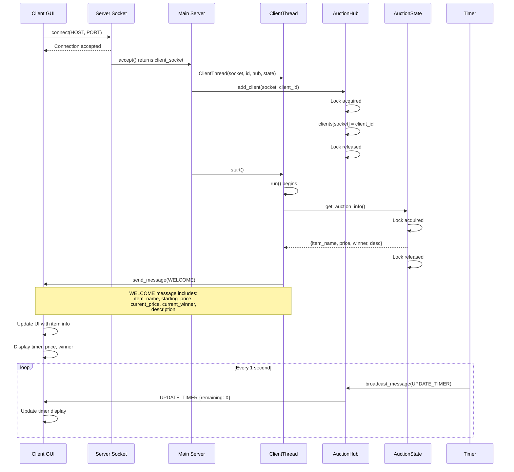

**Mô tả:**
1. Client gửi connection request
2. Server accept và tạo ClientThread mới
3. Hub add client vào danh sách (thread-safe với lock)
4. ClientThread gửi WELCOME message với thông tin vật phẩm
5. Client cập nhật UI
6. Client bắt đầu nhận UPDATE_TIMER mỗi giây

---

## 3. Bid Placement Sequence (Success)

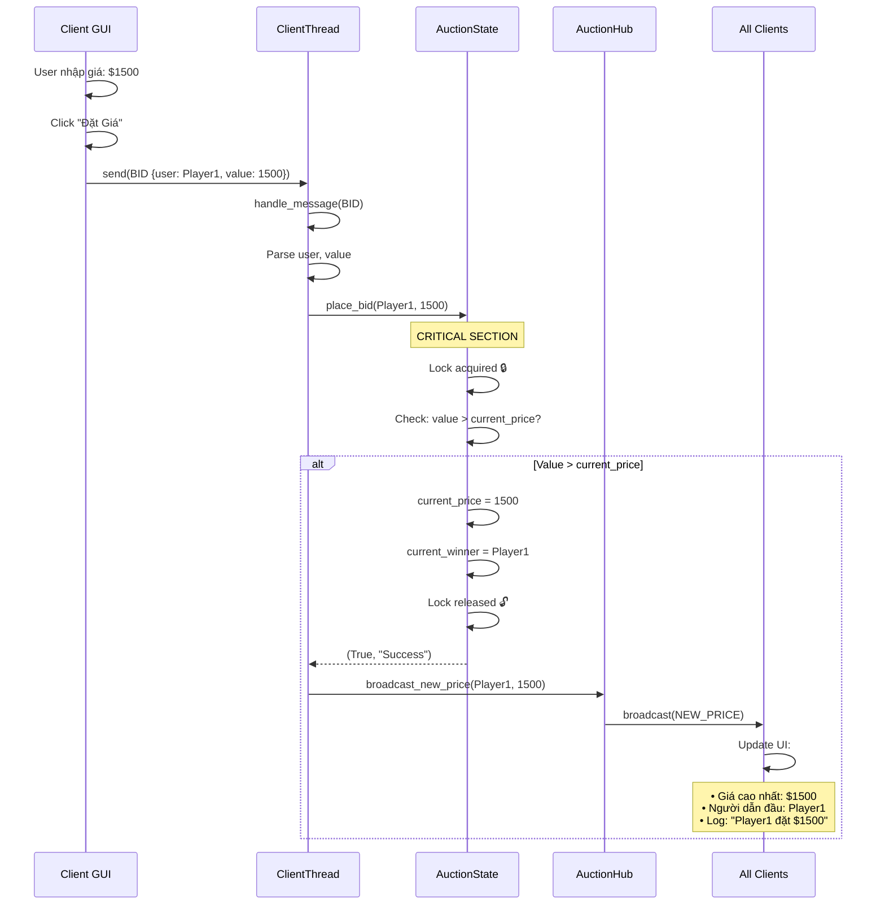

**Mô tả:**
1. Client gửi BID request với giá $1500
2. ClientThread nhận và parse message
3. Gọi `place_bid()` trong AuctionState
4. **Lock được acquire** - CRITICAL SECTION
5. Kiểm tra giá hợp lệ (> current_price)
6. Cập nhật state và release lock
7. Broadcast NEW_PRICE đến tất cả clients
8. Tất cả clients cập nhật UI

---

## 4. Bid Placement Sequence (Failed)

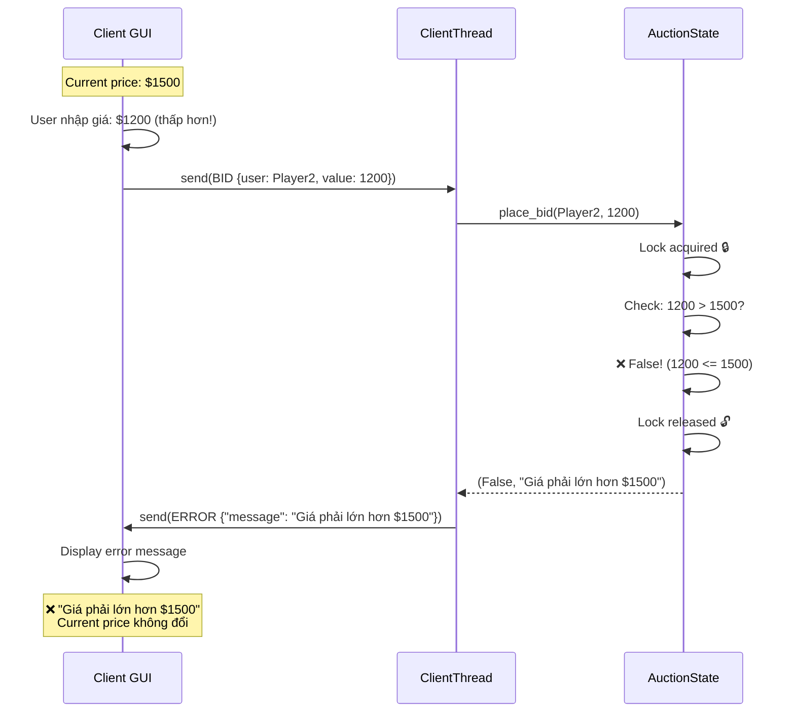

**Mô tả:**
1. Client gửi BID với giá thấp hơn current_price
2. State validate và reject (trong lock)
3. Trả về ERROR message
4. Chỉ client đó nhận error (không broadcast)
5. UI hiển thị lỗi, giá không thay đổi

---

## 5. Race Condition Handling (với Lock)

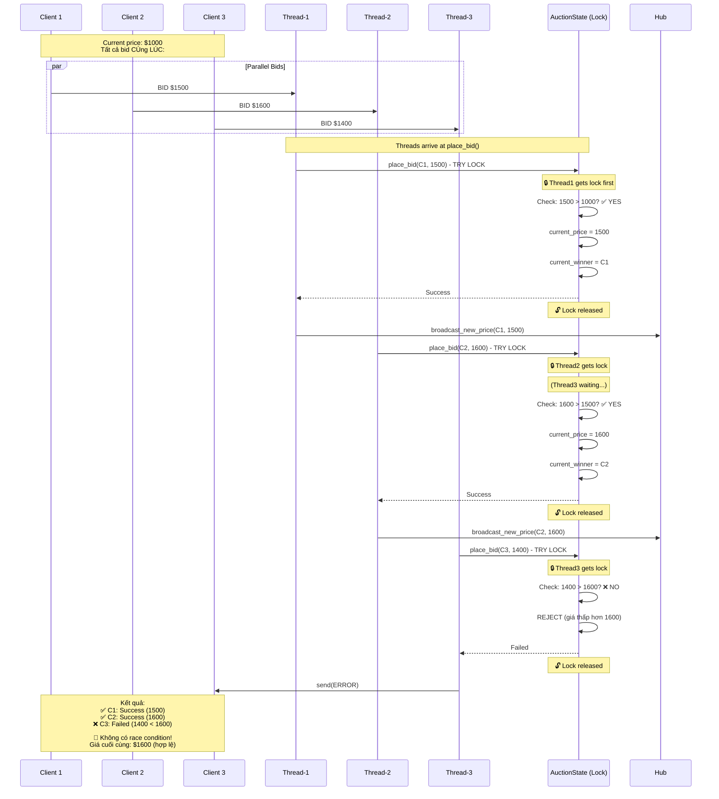

**Mô tả:**
- **Vấn đề:** 3 clients bid đồng thời
- **Giải pháp:** Lock trong AuctionState.place_bid()
- **Kết quả:**
  - Thread1 được lock đầu tiên → Success ($1500)
  - Thread2 chờ lock → Success ($1600 > $1500)
  - Thread3 chờ lock → Failed ($1400 < $1600)
- **Không có race condition:** current_price luôn hợp lệ

---

## 6. Timer Update Sequence

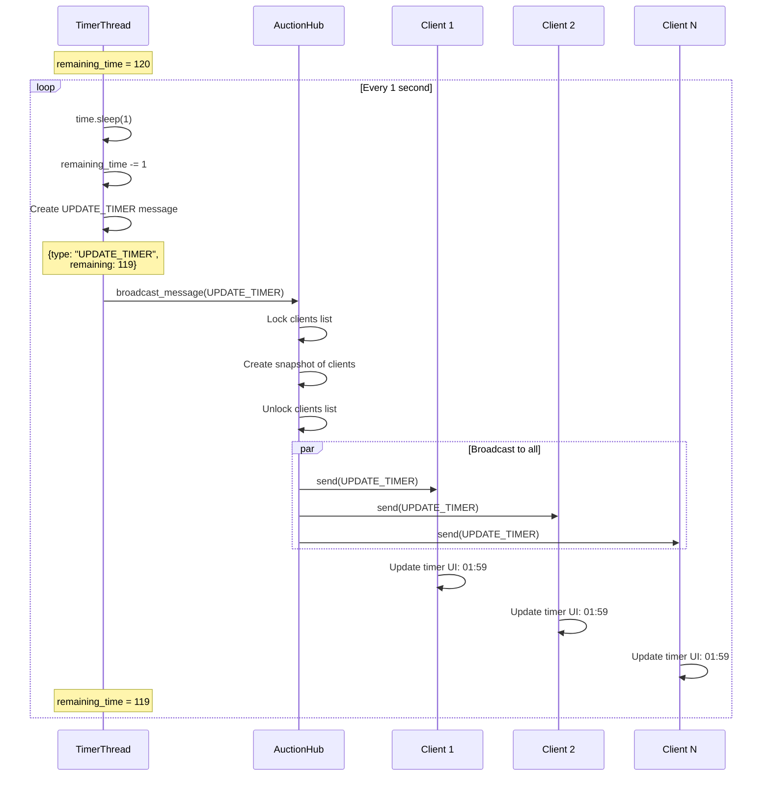

**Mô tả:**
1. TimerThread sleep 1 giây
2. Giảm remaining_time
3. Tạo UPDATE_TIMER message
4. Hub broadcast đến tất cả clients (thread-safe)
5. Mỗi client cập nhật UI timer
6. Lặp lại đến khi remaining_time = 0

---

## 7. Warning Sequence (10s & 5s)

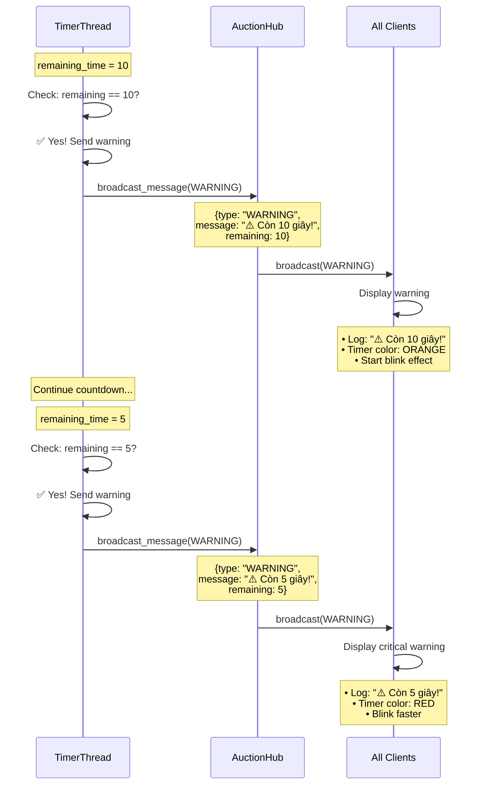

**Mô tả:**
1. Timer kiểm tra remaining_time mỗi giây
2. Khi remaining = 10s → Gửi WARNING
3. Clients hiển thị cảnh báo (màu cam, blink)
4. Khi remaining = 5s → Gửi WARNING thứ 2
5. Clients hiển thị cảnh báo nghiêm trọng (màu đỏ, blink nhanh)

---

## 8. Auction End - Có Winner

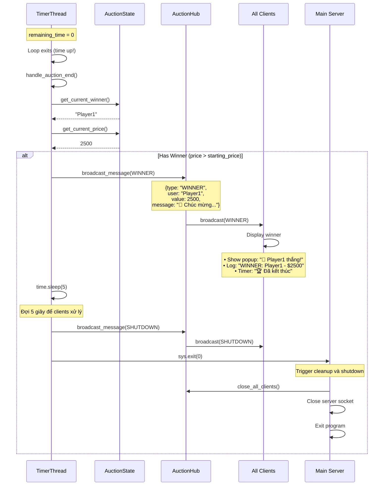

**Mô tả:**
1. Timer hết giờ (remaining = 0)
2. Lấy thông tin winner từ State
3. Broadcast WINNER message đến tất cả clients
4. Clients hiển thị popup và log
5. Đợi 5 giây
6. Broadcast SHUTDOWN
7. Server cleanup và exit

---

## 9. Auction End - Không Có Winner

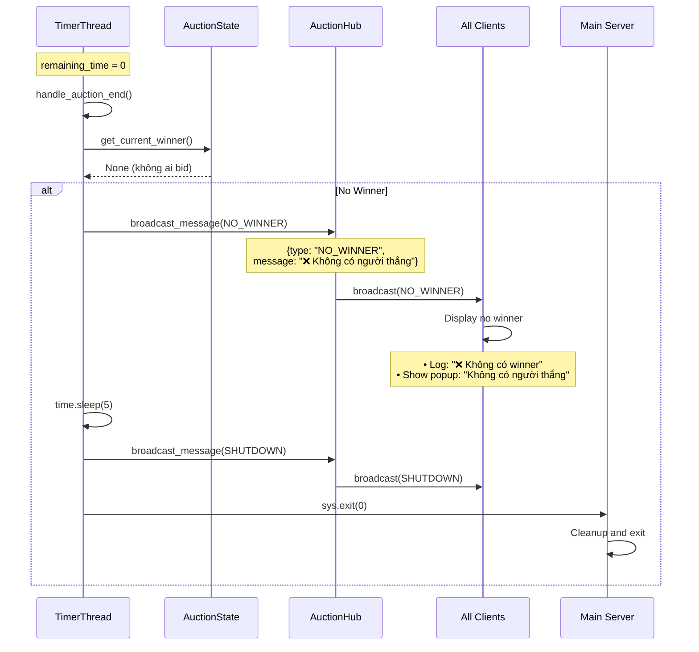

**Mô tả:**
1. Timer hết giờ nhưng current_winner = None
2. Broadcast NO_WINNER message
3. Clients hiển thị thông báo không có winner
4. Đợi 5 giây và shutdown

---

## 10. Client Disconnect Sequence

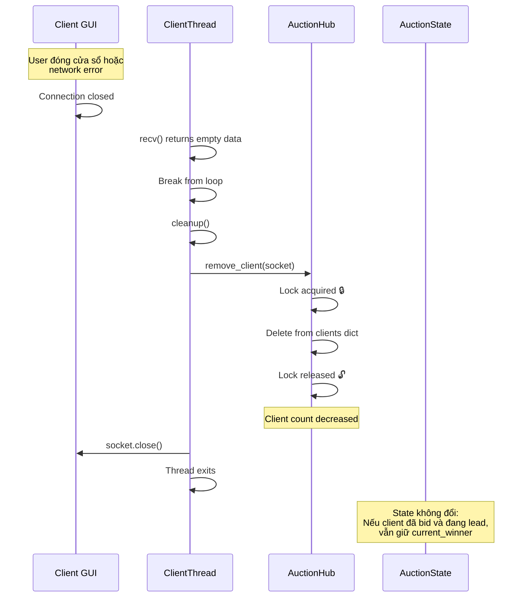

**Mô tả:**
1. Client ngắt kết nối (đóng app hoặc network error)
2. ClientThread phát hiện (recv = empty)
3. Cleanup: remove khỏi Hub
4. Đóng socket
5. Thread exits
6. State không bị ảnh hưởng (winner vẫn giữ)

---

## 11. Server Shutdown Sequence

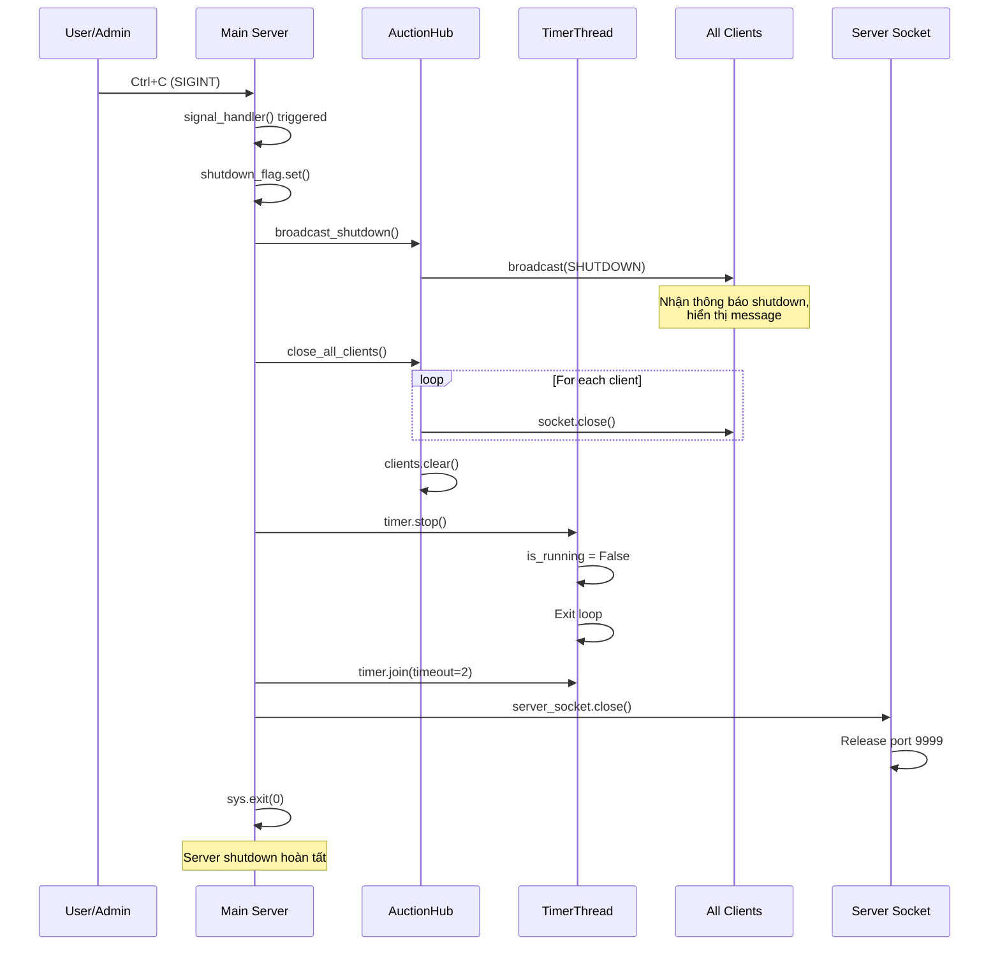

**Mô tả:**
1. Admin nhấn Ctrl+C
2. Signal handler bắt SIGINT
3. Set shutdown_flag
4. Broadcast SHUTDOWN message
5. Đóng tất cả client connections
6. Dừng TimerThread
7. Đóng server socket
8. Exit gracefully

---

## 📌 Chú Thích

### **Ký Hiệu:**
- 🔒 = Lock acquired (Critical Section)
- 🔓 = Lock released
- ✅ = Validation passed
- ❌ = Validation failed
- ⚠️ = Warning
- 🎯 = Important note

### **Thread-Safety:**
- Tất cả truy cập `current_price` và `current_winner` đều trong lock
- Hub.clients dict cũng được bảo vệ bởi lock
- Broadcast sử dụng snapshot để tránh modification during iteration

### **Message Flow:**
- **Unicast:** Server → 1 Client (WELCOME, ERROR)
- **Broadcast:** Server → All Clients (NEW_PRICE, UPDATE_TIMER, WARNING, WINNER, SHUTDOWN)

---

**Document Control:**
- Created: 2025-11-11
- Last Updated: 2025-11-11
- Version: 1.0
